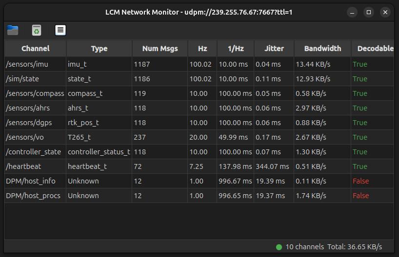
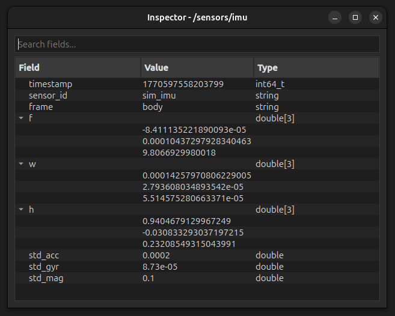

# LCM Network Monitor

A Python-based network monitor for [LCM (Lightweight Communications and Marshalling)](https://lcm-proj.github.io/) traffic, based on the original lcm-spy tool. Created for systems where Java dependencies are problematic or unavailable.

## Description

This is a Python implementation of lcm-spy functionality using PyQt5 and pyqtgraph. It monitors LCM network traffic and provides:

- Real-time traffic overview with channel statistics (message counts, frequencies, jitter, bandwidth)
- Dynamic LCM type discovery and loading from Python modules
- Message inspector with recursive tree view of message fields
- Live plotting of numeric message fields
- Dark theme UI with sortable tables, search, and keyboard shortcuts

## Screenshots

### Main Window


Main window showing active LCM channels with statistics. Double-click column headers to sort.

### Message Inspector


Inspector window with tree view of message fields. Double-click numeric fields to plot.

## Background

Python port of the Java-based lcm-spy utility. Developed when Java package updates broke the original tool. Provides equivalent monitoring functionality using pure Python dependencies.

## Project Structure

```
lcm_monitor/
├── lcm_monitor/              # Main package
│   ├── __init__.py           # Package initialization  
│   ├── __main__.py           # Module entry point
│   ├── lcm_network_monitor.py # Main window
│   ├── lcm_spy.py            # LCM message spy & type detection
│   ├── inspector_window.py   # Message inspector UI
│   ├── plot_window.py        # Real-time plotting
│   ├── base_window.py        # Shared child window base class
│   ├── channel_stats.py      # Statistics tracking
│   ├── styles.py             # UI theme
│   └── utils.py              # Utility functions
├── run.py                    # Standalone entry point
├── test.py                   # Traffic simulator
├── pyproject.toml            # Package configuration
├── README.md                 # This file
└── LICENSE                   # MIT License
```

## Installation

### Ubuntu/Debian

Install system dependencies:
```bash
sudo apt install python3-pyqt5 python3-pyqtgraph liblcm-dev python3-lcm git
```

Clone and install:
```bash
git clone https://github.com/mbsm/lcm-monitor.git
cd lcm-monitor
pip3 install --user .
```

A desktop launcher is created automatically on the first run.

Run from terminal:
```bash
python3 -m lcm_monitor
```

Or launch from applications menu: Search for "LCM Network Monitor"

### Other Platforms

Install dependencies according to the [LCM documentation](https://lcm-proj.github.io/), then:
```bash
pip install PyQt5 pyqtgraph
python3 -m lcm_monitor
```

## Usage

### Running the Monitor

As a Python module:
```bash
python3 -m lcm_monitor
```

Or using run.py:
```bash
python3 run.py
```

### Command Line Options

Specify LCM URL:
```bash
python3 -m lcm_monitor -u="udpm://239.255.76.67:7667?ttl=1"
```

Load LCM types:
```bash
python3 -m lcm_monitor -p=/path/to/lcmtypes/python
```

Or use **File > Import LCM Types** from the menu.

### Testing

Generate sample traffic:
```bash
python3 test.py
```

## Usage Guide

### Main Window
- Toolbar: Import Types, Clear Statistics, Properties
- Double-click column headers to sort
- Status bar shows connection status, channel count, bandwidth

### Inspector Window  
- Search bar filters fields
- Right-click to copy values or field names
- Double-click numeric fields to plot
- Press Escape to close

### Plot Window
- Pause/Resume button freezes plot
- Adjust sample size (10-1000)
- Press Escape to close

### Keyboard Shortcuts
- `Ctrl+I` - Import LCM Types
- `Ctrl+K` - Clear Statistics  
- `Ctrl+Q` - Exit
- `Escape` - Close windows

## Technical Details

- Thread-safe design with separate LCM handling thread
- Dynamic type discovery with retry on failed detection (up to 5 attempts per channel)
- Generation-based change detection skips expensive UI rebuilds during idle periods
- Type loading performs I/O outside the lock to avoid blocking the message handler
- 1Hz GUI polling (configurable), high-frequency LCM in background thread
- Window geometry persistence via QSettings

## Author

Matias Bustos SM
Feb 2026

## License

MIT License - see [LICENSE](LICENSE) file.
